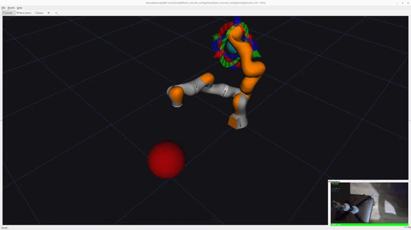
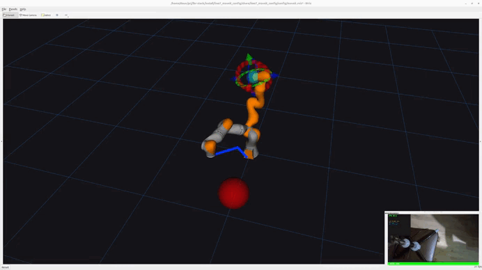

# PTUR Project 

"Динамический учет препятствий в рабочей зоне iiwa на основе зрения: корректировка движения без остановки процесса"

В данном проекте реализуется система динамического перепланирования траектории робота KUKA LBR / iiwa7 в ROS 2 Jazzy. Робот выполняет имитацию сварочного движения в Gazebo, а vision-модуль с камеры отслеживает появление руки рядом с траекторией. При обнаружении опасного сближения текущая траектория отменяется, строится обходной путь, и новая траектория отправляется в контроллер робота.

##
Участникик проекта

Воронцов Константин Владимирович [506527] - Team Lead / разработчик

Взглядов Захар Евгеньевич [507015] - Разработчик

Звонков Георгий Евгеньевич [508936] - Разработчик 

## Клонирование репозитория

```bash
git clone --recurse-submodules https://github.com/clankyrocky1994-rgb/PTUR-PR-project.git
cd PTUR-PR-project
```

Если репозиторий был склонирован без сабмодулей:

```bash
git submodule update --init --recursive
```

## Сборка Docker-образа

```bash
docker compose build
```

## Запуск Docker-контейнера

Для запуска GUI-приложений, например Gazebo или RViz:

```bash
xhost +local:docker
docker compose run --rm ptur-pr
```

## Сборка ROS 2 workspace внутри Docker

ROS 2 workspace собирается автоматически во время сборки Docker-образа.

После входа в контейнер достаточно выполнить:

```bash
source /opt/ros/jazzy/setup.bash
source /workspace/install/setup.bash
```

Если нужно вручную пересобрать workspace внутри контейнера:

```bash
source /opt/ros/jazzy/setup.bash
rm -rf build install log
colcon build
source install/setup.bash
```

# Robot Vision Live Welding Replanner

ROS 2 Jazzy проект для динамического перепланирования сварочной траектории с использованием KUKA LBR / iiwa7, MoveIt, Gazebo, RViz и детекции руки с камеры.

Робот следует по начальной сварочной траектории. Если рука обнаруживается слишком близко к траектории, активное движение отменяется, после чего строится и отправляется новая обходная траектория.

## Основные компоненты

* KUKA LBR / iiwa7 в режиме Gazebo
* MoveIt IK service
* визуализация в RViz
* ROS 2 bridge для hand detection
* приложение детекции руки с камеры
* live welding trajectory replanner

## Структура репозитория

```text
src/my_robot_control
src/robot_vision_msgs
src/robot_vision_ros2
robot_vision_app
```

## Требования

Проект запускается через Docker. Docker-образ содержит основное окружение:

* Ubuntu 24.04
* ROS 2 Jazzy
* KUKA LBR ROS 2 stack
* Gazebo
* MoveIt
* RViz
* Python 3
* OpenCV / MediaPipe / Ultralytics для vision app
* Камера

## Сборка ROS 2 Workspace

Если Docker-образ уже собран, ROS 2 workspace внутри контейнера уже должен быть собран автоматически.

Для подключения окружения внутри контейнера:

```bash
source /opt/ros/jazzy/setup.bash
source /workspace/install/setup.bash
```

Для ручной пересборки workspace внутри контейнера:

```bash
source /opt/ros/jazzy/setup.bash

rm -rf build install log
colcon build

source install/setup.bash
```

Пересборка только пакета управления:

```bash
source /opt/ros/jazzy/setup.bash
source /workspace/install/setup.bash

colcon build --packages-select my_robot_control
source install/setup.bash
```

## Установка Python-зависимостей для Vision App

В Docker-образе Python-зависимости устанавливаются автоматически в отдельное виртуальное окружение:

```text
/opt/vision_venv
```

Для активации окружения внутри контейнера:

```bash
source /opt/vision_venv/bin/activate
```

Проверка зависимостей:

```bash
source /opt/vision_venv/bin/activate
python3 -c "import cv2; import torch; import ultralytics; print('vision ok')"
```

## Запуск

Откройте отдельные терминалы для каждого шага.

Порядок запуска важен:

1. KUKA в режиме Gazebo с MoveIt и RViz
2. fake camera TF
3. robot vision ROS 2 bridge
4. camera hand detection app
5. live welding replanner

Для каждого нового терминала нужно запустить контейнер:

```bash
docker compose run --rm ptur-pr
```

## 1. Запуск KUKA в Gazebo Mode с MoveIt и RViz

Внутри контейнера:

```bash
source /opt/ros/jazzy/setup.bash
source /workspace/install/setup.bash

ros2 launch lbr_bringup gazebo.launch.py ctrl:=joint_trajectory_controller model:=iiwa7
```

Этот шаг запускает робота в Gazebo mode и поднимает необходимые MoveIt-сервисы.

После этого должны быть доступны:

```text
Gazebo simulation
RViz
MoveIt
/lbr/compute_ik
/lbr/joint_states
/lbr/joint_trajectory_controller/follow_joint_trajectory
```

Проверка контроллеров:

```bash
ros2 control list_controllers
```

Ожидаемые активные контроллеры:

```text
joint_state_broadcaster
joint_trajectory_controller
```

Проверка MoveIt IK service:

```bash
ros2 service list | grep compute_ik
```

Ожидаемый результат:

```text
/lbr/compute_ik
```

Проверка trajectory action:

```bash
ros2 action list | grep trajectory
```

Ожидаемый результат:

```text
/lbr/joint_trajectory_controller/follow_joint_trajectory
```

## 2. Настройка RViz

RViz должен быть открыт до запуска live replanner.

```bash
source /opt/ros/jazzy/setup.bash
source /workspace/install/setup.bash

ros2 launch lbr_bringup move_group.launch.py model:=iiwa7 mode:=gazebo rviz:=true
```

Fixed frame:

```text
lbr_link_0
```

Полезные displays:

```text
TF
/live_hand_marker
/live_replanned_path
```

## 3. Запуск Fake Camera TF

Внутри контейнера:

```bash
source /opt/ros/jazzy/setup.bash
source /workspace/install/setup.bash

ros2 run tf2_ros static_transform_publisher \
  --x -0.8 \
  --y 0.0 \
  --z 0.7 \
  --roll 3.1416 \
  --pitch 0.0 \
  --yaw 3.1416 \
  --frame-id lbr_link_0 \
  --child-frame-id fake_camera_link
```

Альтернативный transform, если ось Z перевёрнута:

```bash
source /opt/ros/jazzy/setup.bash
source /workspace/install/setup.bash

ros2 run tf2_ros static_transform_publisher \
  --x -0.8 \
  --y 0.0 \
  --z 0.7 \
  --roll 0.0 \
  --pitch 3.1416 \
  --yaw 3.1416 \
  --frame-id lbr_link_0 \
  --child-frame-id fake_camera_link
```
При запускке на реальном роботе нужно проводить Eye-hand калибровку

Полезная утилита для проведения калибровки

[Здесь](https://github.com/AndrejOrsula/moveit2_calibration)

## 4. Запуск Robot Vision ROS 2 Bridge

Внутри контейнера:

```bash
source /opt/ros/jazzy/setup.bash
source /workspace/install/setup.bash

ros2 launch robot_vision_ros2 hand_bridge.launch.py frame_id:=fake_camera_link
```

Bridge публикует данные обнаруженной руки в ROS 2.

Основной topic:

```text
/robot_vision/hands
```

## 5. Запуск Camera Hand Detection App

Внутри контейнера:

```bash
cd /workspace/robot_vision_app
source /opt/vision_venv/bin/activate

python3 src/robot_vision_v3.py --config config/config.yaml
```

Проверка публикации данных о руке:

```bash
ros2 topic echo /robot_vision/hands
```

## 6. Запуск Live Welding Replanner

Запускайте этот узел только после Gazebo, MoveIt, RViz, TF и hand detection.

Внутри контейнера:

```bash
source /opt/ros/jazzy/setup.bash
source /workspace/install/setup.bash

ros2 run my_robot_control welding_replanner
```

Ожидаемый вывод:

```text
live_welding_replanner started
Waiting for robot data...
Sending initial welding trajectory
Trajectory accepted
HAND TOO CLOSE
Cancel requested
Sending new live-replanned trajectory
Trajectory accepted
```

## Полезные команды

Проверка topics для hand detection и replanning:

```bash
ros2 topic list | grep -E "robot_vision|live|hand"
```

Проверка контроллеров робота:

```bash
ros2 control list_controllers
```

Проверка fake camera TF:

```bash
ros2 run tf2_ros tf2_echo lbr_link_0 fake_camera_link
```

Проверка MoveIt IK service:

```bash
ros2 service list | grep compute_ik
```

Проверка trajectory action:

```bash
ros2 action list | grep trajectory
```

Проверка сообщений о руке:

```bash
ros2 topic echo /robot_vision/hands
```

## Логика перепланирования

1. Робот начинает движение от начальной точки сварки A к конечной точке B.
2. Узел читает позицию руки из `/robot_vision/hands`.
3. Позиция руки трансформируется из `fake_camera_link` в `lbr_link_0`.
4. Если рука находится слишком близко к сварочной траектории, текущая траектория отменяется.
5. Генерируется обходная точка C.
6. Новая траектория A → C → B отправляется в контроллер робота.

Это reactive live replanning с обходной точкой.

## Видео реализации

### Перенос руки в симуляцию



### Пример работы алгоритма



## Цитирование

В проекте используется LBR-Stack. Если вы используете этот проект или LBR-Stack в академической работе, можно ссылаться на:

```bibtex
@article{Huber2024,
  doi       = {10.21105/joss.06138},
  url       = {https://doi.org/10.21105/joss.06138},
  year      = {2024},
  publisher = {The Open Journal},
  volume    = {9},
  number    = {103},
  pages     = {6138},
  author    = {Martin Huber and Christopher E. Mower and Sebastien Ourselin and Tom Vercauteren and Christos Bergeles},
  title     = {LBR-Stack: ROS 2 and Python Integration of KUKA FRI for Med and IIWA Robots},
  journal   = {Journal of Open Source Software}
}
```
## Лицензия

Этот проект распространяется под лицензией MIT. См. файл [LICENSE](LICENSE).
